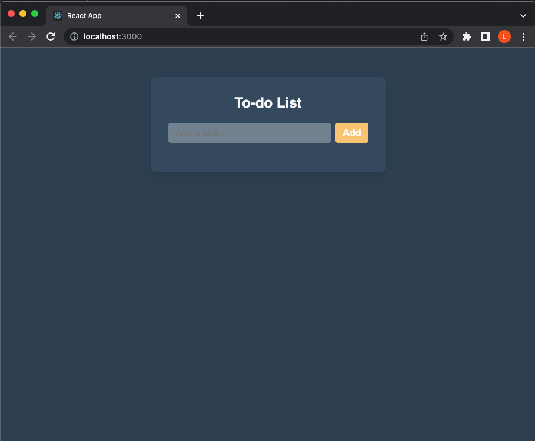
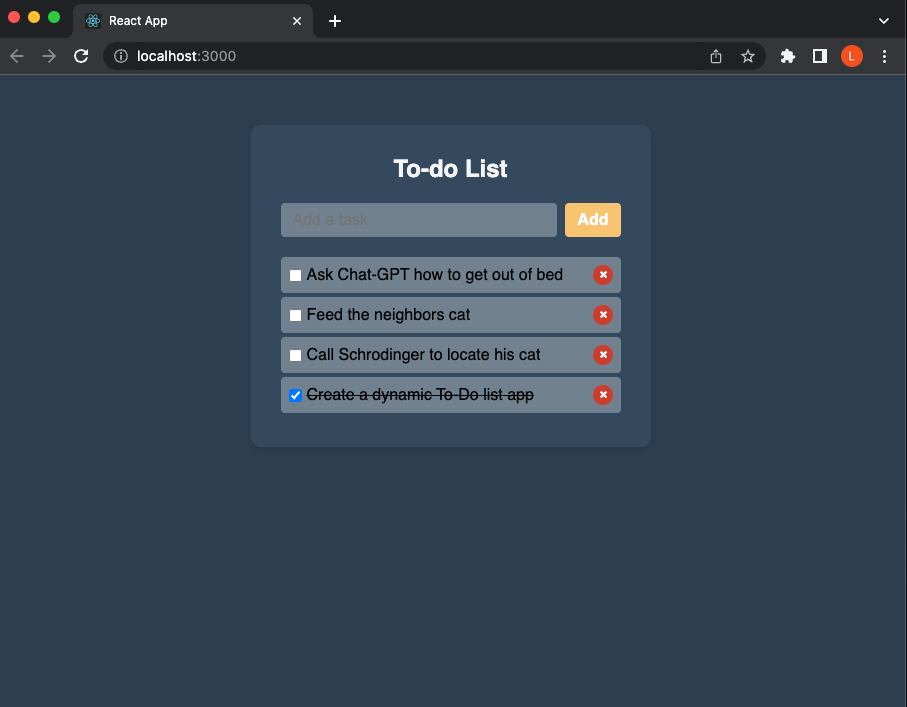

# Core Assignment "ToDo List"

This is Christian Johnson's work for Coding Dojo's Part-Time Accelerated MERN Stack.
It was submitted on April 23, 2023.

## Assignment description

Create a To-Do List React App. With a form, the user enters a string which will be their task. A check box is included to update the task as complete, altering the css to include a strikethrough. The user should also be able to delete tasks from the array.

## Additional Embeleshments

Did not proceed with additional chalenges. I explored other options for removing a task, beyond the `filter()` method. `splice` seemed to get the job done as well. I did have guidence from MDN React documentaion (which uses a ToDo list as an example of how to manage state) https://developer.mozilla.org/en-US/docs/Learn/Tools_and_testing/Client-side_JavaScript_frameworks/React_todo_list_beginning and Abhishek EH on https://www.codingdeft.com/posts/react-to-do-list/

